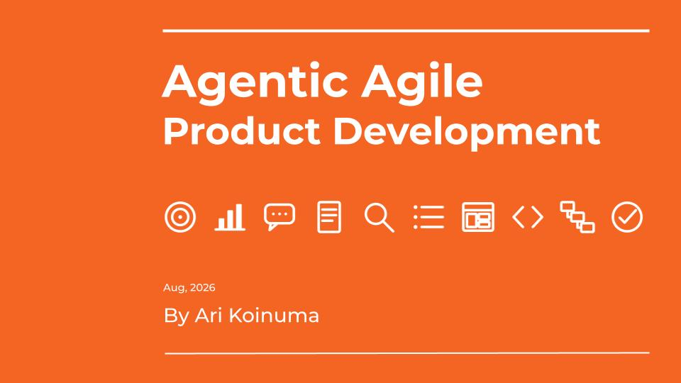
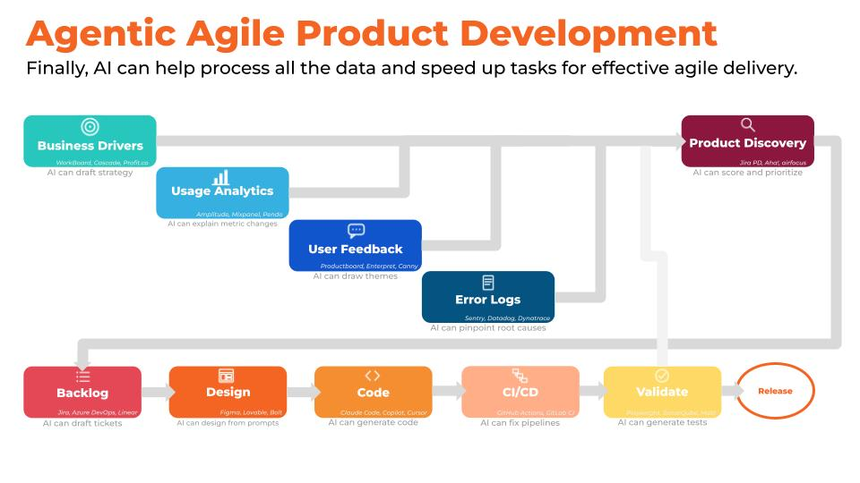

# Agentic Agile Product Development

*A POV on why Agile exists, why most operations miss the point, and how AI removes the excuse for skipping it.*

📄 **[Download PDF](Agentic_Agile_Product_Development_by_Ari_Koinuma.pdf)**

📄 **[Download PPTX](Agentic_Agile_Product_Development_by_Ari_Koinuma.pptx)**

## Overview

Most Agile product operations run the ceremonies without the point. Sprints get planned, standups happen, roadmaps ship on schedule. Ask what the user feedback says, or whether the error logs point to a concern, and the answer is often a shrug.

> "Many places are using Agile as a timeboxed waterfall."

Agile exists because business conditions change constantly. Timeboxing releases isn't the goal, it's a forcing function: a way to keep teams listening to business drivers, usage data, user feedback, and system logs, then reprioritizing based on what that signal says. Skip the listening, and Agile becomes a timeboxed waterfall, one where a missed result gets blamed on the roadmap instead of the execution.

Before AI, running that kind of continuously-informed operation took the budget and maturity of a large, established organization. Processing four channels of raw signal into structured priorities, every cycle, was expensive work.

It no longer is.

## The Framework

AI now performs each activity in the Agile product lifecycle at a level that used to require a dedicated team to staff. The table below maps what AI can do at each stage, and the platforms leading that category as of 2026.

| Stage | AI can... | Leading tools |
|---|---|---|
| Business Drivers | Draft strategy | WorkBoard, Cascade, Profit.co |
| Usage Analytics | Explain metric changes | Amplitude, Mixpanel, Pendo |
| User Feedback | Draw themes | Productboard, Enterpret, Canny |
| System Logs | Pinpoint root causes | Sentry, Datadog, Dynatrace |
| Product Discovery | Score and prioritize | Jira Product Discovery, Aha!, airfocus |
| Backlog | Draft tickets | Jira, Azure DevOps, Linear |
| Design | Design from prompts | Figma, Lovable, Bolt |
| Code | Generate code | Claude Code, Copilot, Cursor |
| CI/CD | Fix pipelines | GitHub Actions, GitLab CI |
| Validate | Generate tests | Playwright, SonarQube, Mabl |

*Leading tools were selected based on researching adoption, revenue, and funding signals. A tool listed here does not indicate my endorsement or that I have personal experience using them.*

Agility is now more accessible than ever. That means success is, too.

## About the Author

Ari Koinuma is an engineering leader with 15 years leading product and platform engineering teams. I'm currently (2026 Q3) exploring Director, Senior Director, VP, and Head of Engineering roles at product-led companies. If this resonates, connect with me on [LinkedIn](https://www.linkedin.com/in/arikoinuma/).